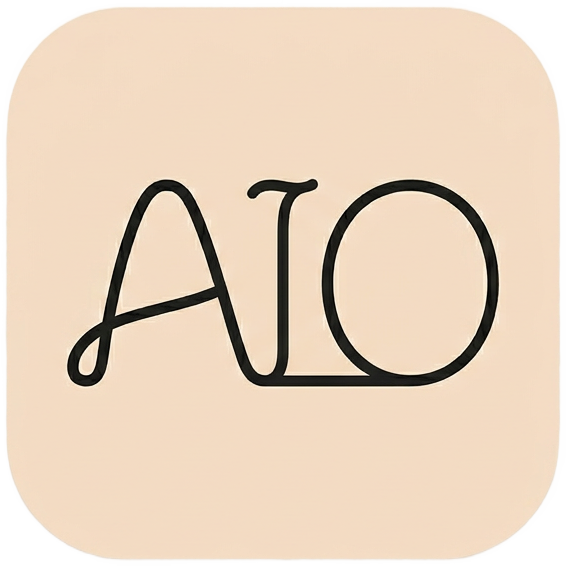

<p align="center">
  
</p>

<h1 align="center">AIO Studio</h1>

<p align="center">
  <a href="LICENSE">
    
  </a>
</p>

<p align="center">
  <strong>跨平台 AGI 项目与资产管理工具</strong>
</p>

<p align="center">
  <a href="#功能特性">功能特性</a> •
  <a href="#截图预览">截图预览</a> •
  <a href="#快速开始">快速开始</a> •
  <a href="#技术架构">技术架构</a> •
  <a href="#项目结构">项目结构</a> •
  <a href="#浏览器扩展">浏览器扩展</a> •
  <a href="#开发指南">开发指南</a> •
  <a href="#许可证">许可证</a>
</p>

---

## 简介

AIO Studio 是一个面向 AI 创作者的一站式工作台。它将 **AI 对话**、**图片生成**、**视频生成**、**提示词管理** 和 **数字资产管理** 整合在一个桌面/移动应用中，帮助你高效地组织和推进 AGI 相关项目。

配套的**浏览器扩展**支持一键将网页中的图片、视频等素材保存到本地项目中，打通从灵感收集到 AI 创作的完整工作流。

## 功能特性

### 🤖 AI 对话

- 支持 OpenAI、Anthropic、自定义兼容 API 等多种服务商
- 流式输出、Markdown 渲染、代码高亮
- 多会话管理与历史记录
- 灵活的模型选择与参数配置

### 🎨 AI 图片生成

- 集成 DALL-E、Stability AI 等图片生成服务
- 可视化参数调节面板
- 生成结果一键保存为项目资产
- 历史记录与预览

### 🎬 AI 视频生成

- 文生视频 / 图生视频
- 异步任务队列与状态轮询
- 生成结果预览与管理

### 📁 项目管理

- 项目创建、编辑、归档
- 按项目组织资产、提示词与 AI 任务
- 项目级统计与概览

### 🗂️ 资产管理

- 多格式资产导入（图片、视频、音频、文本）
- 标签系统与收藏功能
- 多种筛选与排序方式
- 内置图片查看器、视频/音频播放器
- 拖拽导入支持

### 📝 提示词库

- 提示词的创建、分类与版本管理
- 变量模板支持
- AI 辅助提示词优化
- 关联到项目使用

### 🌐 浏览器扩展

- 一键保存网页图片/视频到 AIO Studio
- 实时连接本地应用，无需手动导入
- 支持 Chrome / Edge

### 🎛️ 设置与个性化

- 亮色 / 暗色主题切换
- 多种桌面窗口效果（Acrylic / Mica 等毛玻璃特效）
- 自定义主题色
- 中英文双语

## 平台支持

| 平台 | 状态 |
|------|------|
| Windows | ✅ 完整支持（含 MSIX 打包） |
| macOS | ✅ 支持 |
| Linux | ✅ 支持 |
| Android | ✅ 支持 |
| iOS | ✅ 支持 |
| Web | 🚧 部分支持 |

## 快速开始

### 环境要求

- [Flutter](https://flutter.dev/) 3.10.7 或更高版本
- Dart SDK ^3.10.7
- 各平台对应的开发工具链

### 安装与运行

```bash
# 克隆仓库
git clone https://github.com/your-username/aio-studio.git
cd aio-studio

# 安装依赖
flutter pub get

# 生成数据库代码（drift）
dart run build_runner build --delete-conflicting-outputs

# 运行应用（桌面端）
flutter run -d windows   # 或 macos / linux

# 运行应用（移动端）
flutter run -d android    # 或 ios
```

### 构建发布版本

```bash
# Windows MSIX 包
dart run msix:create

# Windows 安装包（需本机安装 Inno Setup 6）
flutter build windows --release
& "C:\Program Files (x86)\Inno Setup 6\ISCC.exe" installer\aio_studio.iss /DAppVersion=1.0.7

# Android APK
flutter build apk --release

# iOS
flutter build ios --release
```

## 技术架构

```
┌─────────────────────────────────────────────────────┐
│                    AIO Studio App                   │
├──────────┬──────────┬──────────┬──────────┬─────────┤
│ AI 对话  │ AI 图片  │ AI 视频  │ 资产管理 │ 项目管理│
├──────────┴──────────┴──────────┴──────────┴─────────┤
│                  共享组件 & 工具层                    │
├──────────┬──────────┬──────────┬────────────────────┤
│ Riverpod │ go_router│  drift   │ AI Service Layer   │
│ 状态管理 │   路由   │ SQLite   │ (多服务商抽象)      │
├──────────┴──────────┴──────────┴────────────────────┤
│              Flutter + fluent_ui                     │
├─────────────────────────────────────────────────────┤
│    Windows │ macOS │ Linux │ Android │ iOS │ Web     │
└─────────────────────────────────────────────────────┘
         ↕ HTTP (shelf)
┌─────────────────────┐
│   浏览器扩展         │
│ (Chrome / Edge)     │
└─────────────────────┘
```

### 核心技术栈

| 组件 | 技术 |
|------|------|
| UI 框架 | [fluent_ui](https://pub.dev/packages/fluent_ui) — Windows Fluent Design 风格 |
| 状态管理 | [flutter_riverpod](https://pub.dev/packages/flutter_riverpod) |
| 路由 | [go_router](https://pub.dev/packages/go_router) |
| 本地数据库 | [drift](https://pub.dev/packages/drift) (SQLite) |
| HTTP 客户端 | [dio](https://pub.dev/packages/dio) |
| 窗口管理 | [window_manager](https://pub.dev/packages/window_manager) |
| 窗口特效 | [flutter_acrylic](https://pub.dev/packages/flutter_acrylic) |
| 媒体播放 | [media_kit](https://pub.dev/packages/media_kit) |
| 扩展桥接 | [shelf](https://pub.dev/packages/shelf) 本地 HTTP 服务器 |
| 密钥安全 | [flutter_secure_storage](https://pub.dev/packages/flutter_secure_storage) |
| 浏览器扩展 | TypeScript + React 19 + Vite |

## 项目结构

```
aio-studio/
├── lib/
│   ├── main.dart                    # 应用入口
│   ├── app.dart                     # 根组件
│   ├── core/
│   │   ├── database/                # Drift 数据库、表定义、DAO
│   │   ├── providers/               # 全局 Provider
│   │   ├── router/                  # 路由配置
│   │   ├── services/
│   │   │   ├── ai/                  # AI 服务抽象层（多服务商）
│   │   │   ├── extension_bridge/    # 浏览器扩展桥接服务
│   │   │   └── storage/             # 文件存储服务
│   │   ├── theme/                   # 主题配置
│   │   └── utils/                   # 工具函数
│   ├── features/
│   │   ├── ai_chat/                 # AI 对话模块
│   │   ├── ai_image/                # AI 图片生成模块
│   │   ├── ai_video/                # AI 视频生成模块
│   │   ├── assets/                  # 资产管理模块
│   │   ├── projects/                # 项目管理模块
│   │   ├── prompts/                 # 提示词管理模块
│   │   └── settings/                # 设置模块
│   └── shared/                      # 共享组件与工具
├── extension/                       # 浏览器扩展源码
├── assets/                          # 资源文件
├── test/                            # 单元测试与组件测试
└── docs/                            # 开发文档
```

每个功能模块遵循 **feature-first** 组织方式：

```
feature/
├── models/        # 数据模型
├── providers/     # 状态管理 (Riverpod)
├── views/         # 页面
└── widgets/       # 组件
```

## 浏览器扩展

浏览器扩展 (`extension/`) 用于从网页快速采集素材到 AIO Studio。

### 构建扩展

```bash
cd extension
npm install
npm run build
```

构建产物可作为未打包扩展加载到 Chrome 或 Edge 中。

### 工作原理

扩展通过 HTTP 与 AIO Studio 桌面端的本地服务器通信（由 shelf 提供）。桌面端启动时自动开启桥接服务，支持：

- 健康检查
- 获取项目列表
- 导入资产到指定项目

## 开发指南

### 代码生成

项目使用 drift 进行数据库代码生成，修改数据库表定义后需要重新生成：

```bash
dart run build_runner build --delete-conflicting-outputs
```

### 测试

```bash
# 运行所有测试
flutter test

# 运行特定测试文件
flutter test test/dao_test.dart
```

### AI 服务配置

在应用的 **设置 → AI 服务商** 中配置你的 API Key 和端点。支持：

- OpenAI (GPT 系列 / DALL-E)
- Anthropic (Claude 系列)
- Stability AI (图片生成)
- 自定义 OpenAI 兼容 API

所有 API Key 通过 `flutter_secure_storage` 加密存储。

## 许可证

本项目基于 [GNU Affero General Public License v3.0 (AGPL-3.0)](LICENSE) 开源。
